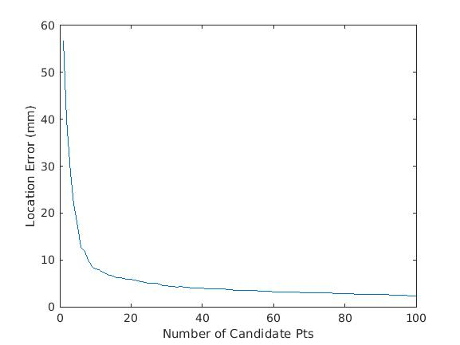
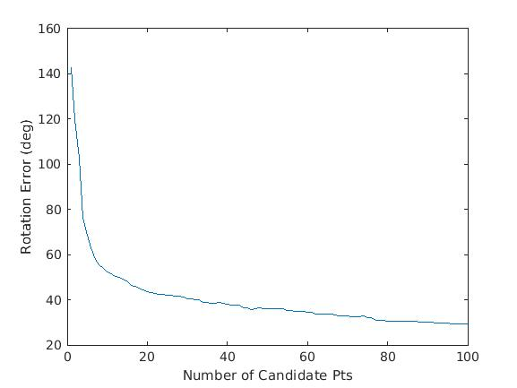
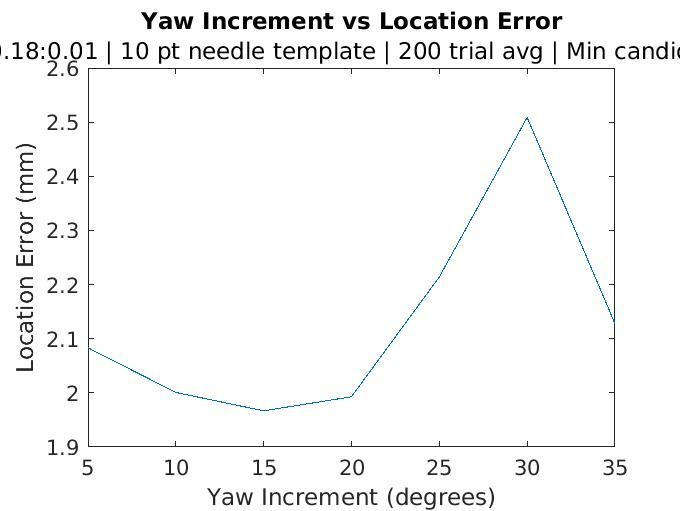
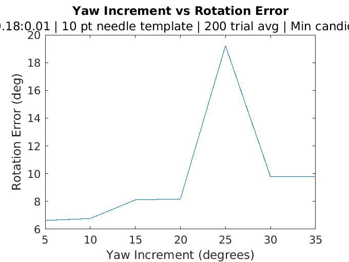
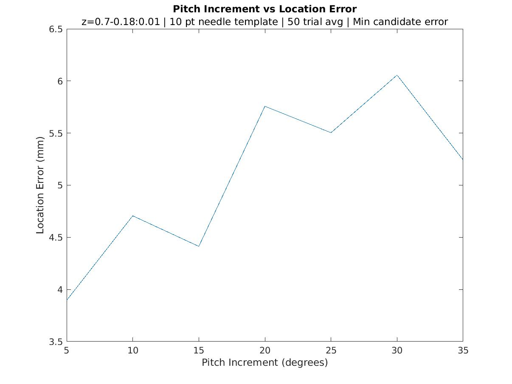
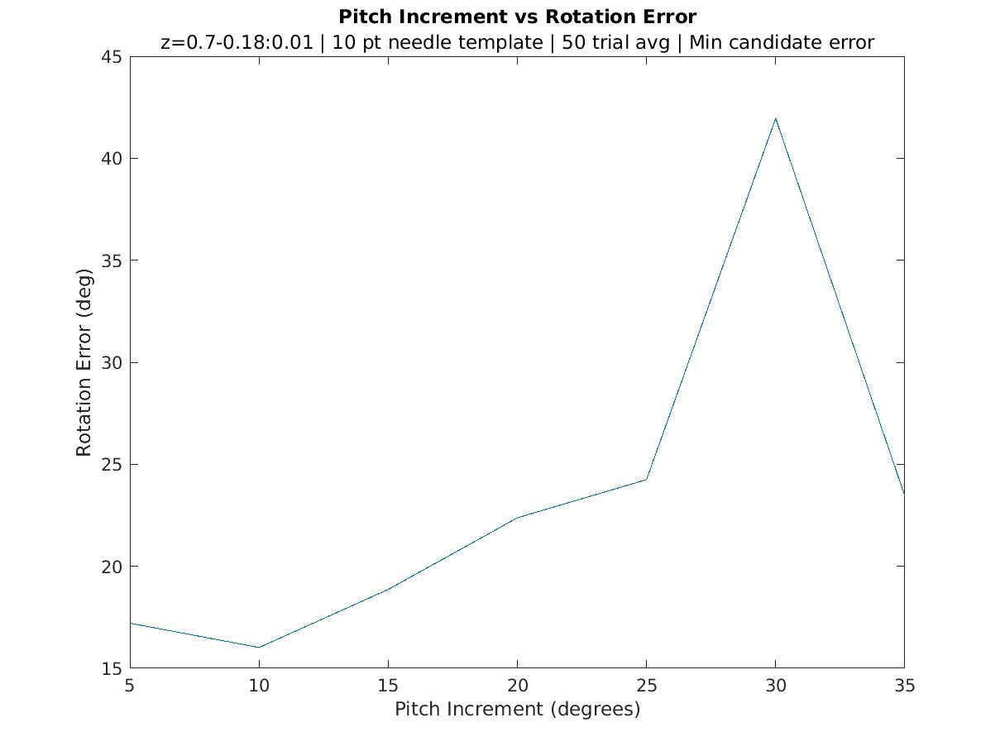
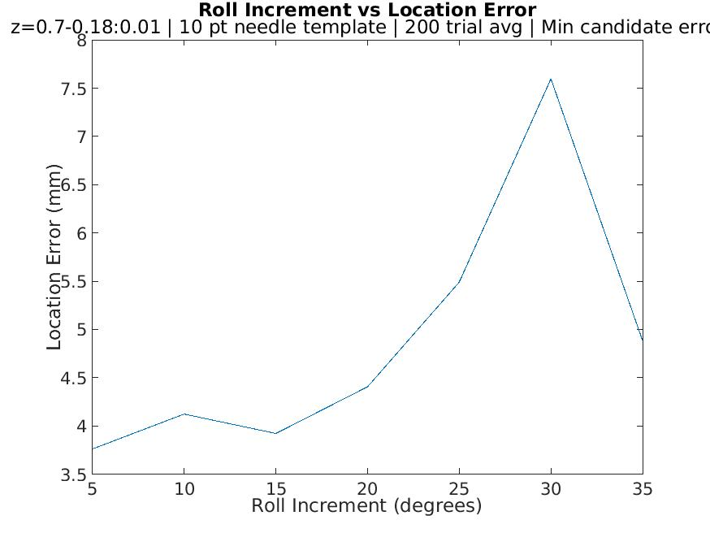
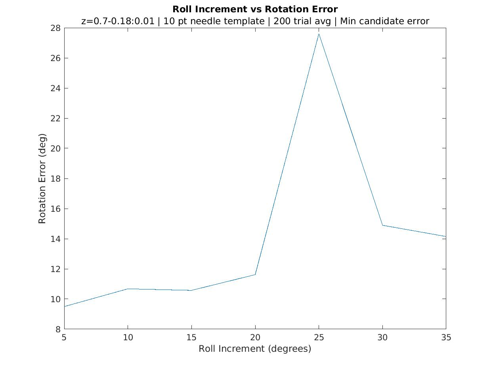

## Running the Simulation and Node for Testing pfc_init Performance
### Configuring the Workspace  
1. Clone the pfc_init project into a catkin workspace src directory
2. Resolve the missing dependencies manually
    * Ros package dependencies can be found in the full workspace [here](fhttps://github.com/tuckerguen/pfc_init_catkin_ws) 
    * *Note: Do not clone and build directly from the linked workspace above*
### Running the Simulation
3. "catkin build" the project, resolve errors
4. source devel/setup.bash from the root dir of the catkin workspace
5. In terminal run: roslaunch sim_gazebo test_pfc_init.launch (there may be errors but just check that the needle and background are spawned properly)
    * You can confirm that the simulation is running properly using (in a new terminal): "rosrun image_view image_view image:=/davinci_endo/left/image_raw"
    * Confirm that you see a needle on a cork board background and that the image is well lit.
### Running the pfc_init Node
6. In a new terminal cd into the workspace, source devel/setup.bash
7. rosrun pfc_init pfc_init_node
8. You may see various images during the process (these are mostly used for debugging). 
    * To continue, press any key
9. Once the program is done running you'll see an output of the results in the terminal and a new csv file containing 
the results will appear in the test_results directory, with the name being the time that the program was run.

# Current (as of 11/06/20) Performance Metrics
## General Performance
Run with parameters:

| Parameter                                                	| Value 	|
|----------------------------------------------------------	|----------	|
| z range                                                  	| 0.7-0.18 	|
| z increment 	                                            | 0.01 	    |
| Rotation range (all axes)                                 | 0-360 	| 
| Rotation increment (all axes)	                            | 30	    |
| # pts in needle template                                 	| 10       	|
| Candidate choice for each pose                            | Min error for metric (location, orientation, time)|
| Multi-threading?                                        | Yes (12 threads)

These parameters for these were picked based on the [Incrementing Metrics](#incrementing-metrics) data, choosing the values
that maximized performance while minimizing runtime.  
  
### Results
***Test 1 - 40 candidate points, 50 poses***  

| Metric                                                	| Mean | Standard Deviation 
|-------------------------------------------------------|----------      |-----         
| Location Error (mm)                                       | 3.0916      |   1.2136             
| Rotation Error (deg)                                      | 29.2060       |   15.0941   |  
| Time (s)                                                  | 20.0986       |   0.4719    |                                                         

***Test 2 - 40 candidate points, 50 poses***    

| Metric                                                	| Mean | Standard Deviation 
|-------------------------------------------------------|----------      |-----         
| Location Error (mm)                                       | 3.8173      |   1.9341              
| Rotation Error (deg)                                      | 40.0688       |  16.8813   |  
| Time (s)                                                  | 20.2947       |   0.5998    |                                                        

***Test 3 - 100 candidate points, 200 poses***  

| Metric                                                	| Mean | Standard Deviation 
|-------------------------------------------------------|----------      |-----         
| Location Error (mm)                                       | 2.2801     |   1.0947              
| Rotation Error (deg)                                      | 29.1297      |  9.7233   |  
| Time (s)                                                  | 19.4277      |   0.3510   |   

## Candidate Point Count vs Performance
Although there is minimal overhead to collecting more candidate points, it's still useful to test to see the degree to 
which there are diminishing returns for adding more candidate points to educate the pick for that parameter.   

Using data from Test 3 above, average rotation and location errors over all 200 poses for a range 
of candidate points quantities from 1 to 100 were sampled. Although the Test 3 data was collected for 100 candidate points,
the subset of candidate points at each candidate point quantity from 1-100 is identical to the set of candidate points 
that the program would return if the data was collected with a maximum number of candidate points equal to that
candidate point quantity.  

Below are graphs of location and rotation error versus the number of candidate points sampled.
 
    

  

## Determining Increment Values
*Note that the following tests are up to date only to 10/16/20. However, the changes between 10/16/20 and 11/6/20 are  
not huge, and I believe the trends seen below still reflect the trends of the current version*  
### Configuration 
There are four parameters that have the greatest effect on performance when running the particle filter auto-initialization:  
* Yaw, Pitch, and Roll increments  (from min to max value, how much to increment for each template matching iteration)  
* Number of candidate points to return (Top n candidate points based on template matching score)  

For each of these, we are concerned with their effects on runtime, location error, and rotation error.  
  
The following tests were conducted with fixed parameters of:  

| Parameter                                                	| Value 	|
|----------------------------------------------------------	|----------	|
| Rotation d.o.f                                            | 1	(rotating only in axis being measured)|
| z range                                                  	| 0.7-0.18 	|
| z increment 	                                            | 0.01 	    | 
| # pts in needle template                                 	| 10       	|
| # random poses                           	        | 200      	|
| # Candidate points (if not measured metric)   | 10
| Candidate choice for each pose                            | Min error for metric          |

### Yaw Increment
  

  

### Pitch Increment
  

  

### Roll Increment
  

  