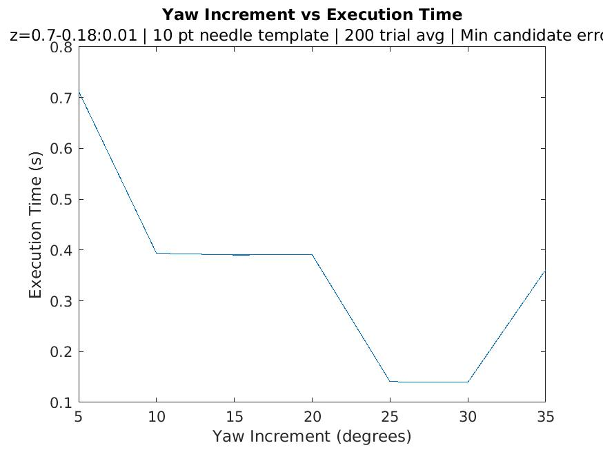
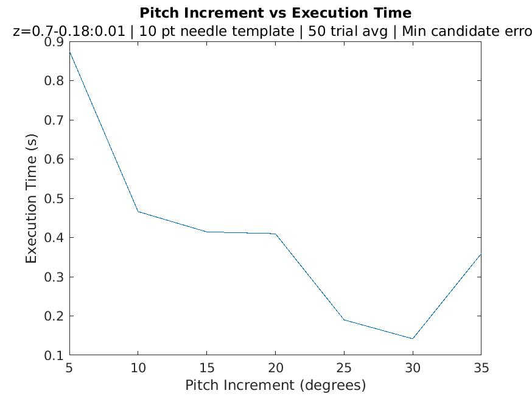
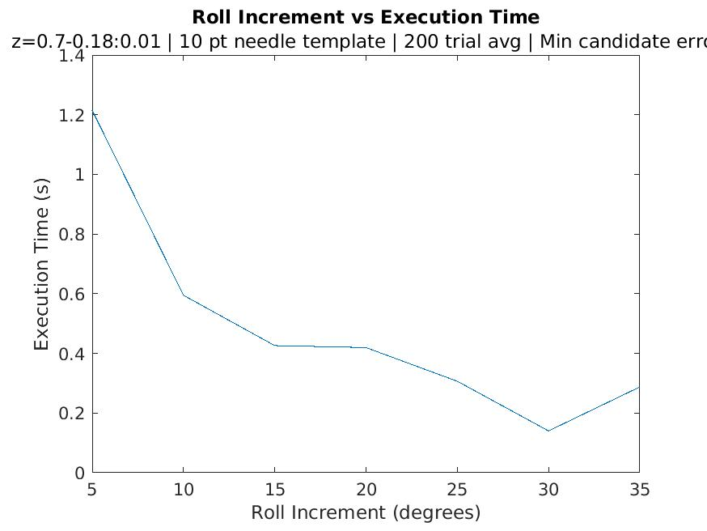
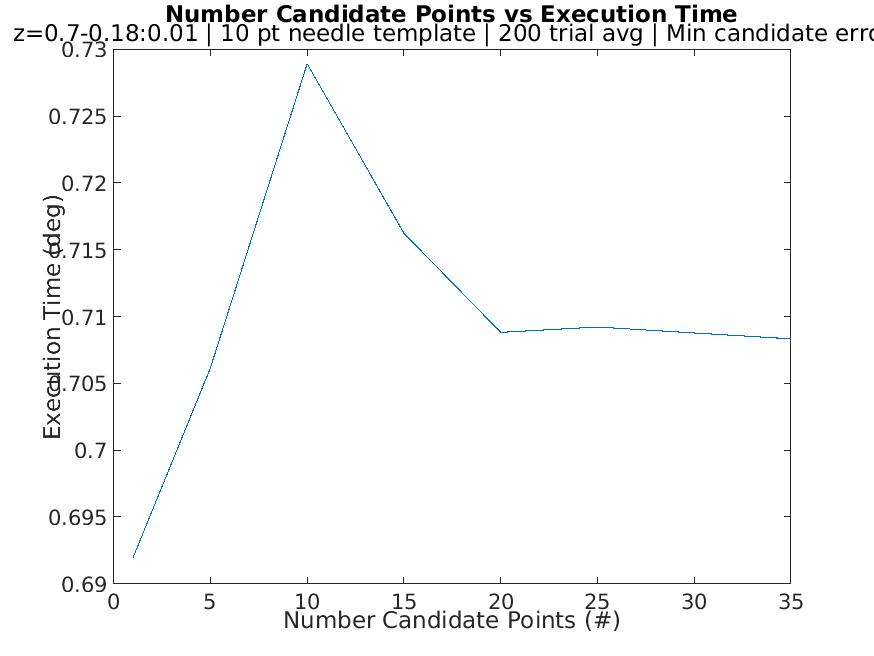
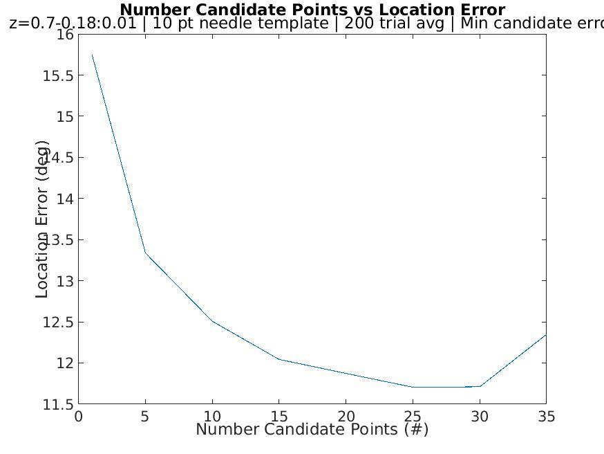
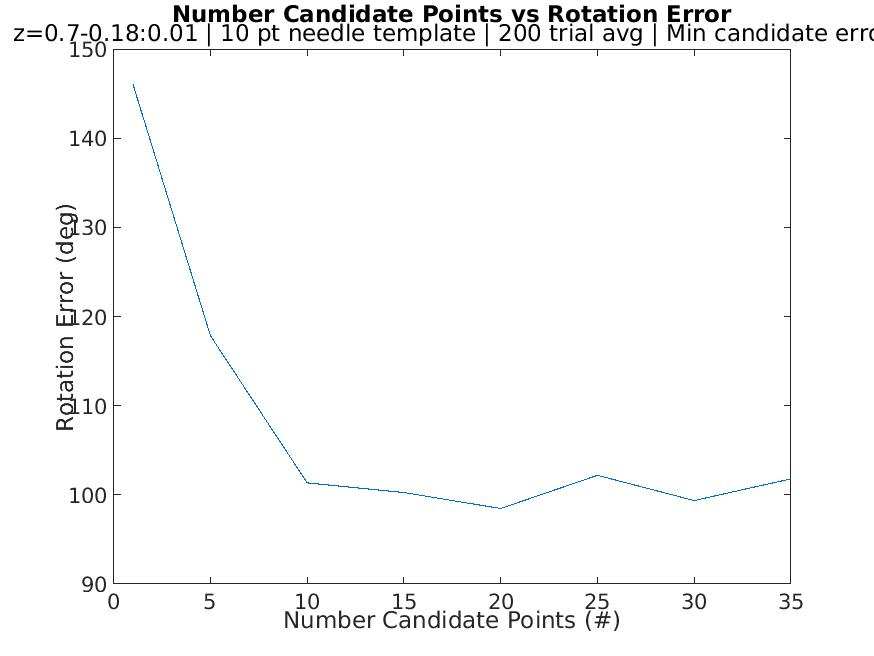

## Running the Simulation and Node for Testing pfc_init Performance
### Configuring the Workspace  
1. Clone the pfc_init project into a catkin workspace src directory
2. Resolve the missing dependencies manually
    * Ros package dependencies can be found in the full workspace [here](fhttps://github.com/tuckerguen/pfc_init_catkin_ws) 
    * *Note: Do not clone and build directly from the linked workspace above*
### Running the Simulation
3. "catkin build" the project, resolve errors
4. source devel/setup.bash from the root dir of the catkin workspace
5. In terminal run: roslaunch sim_gazebo test_pfc_init.launch (there may be errors but just check that the needle and background are spawned properly)
    * You can confirm that the simulation is running properly using (in a new terminal): "rosrun image_view image_view image:=/davinci_endo/left/image_raw"
    * Confirm that you see a needle on a cork board background and that the image is well lit.
### Running the pfc_init Node
6. In a new terminal cd into the workspace, source devel/setup.bash
7. rosrun pfc_init pfc_init_node
8. You may see various images during the process (these are mostly used for debugging). 
    * To continue, press any key
9. Once the program is done running you'll see an output of the results in the terminal and a new csv file containing 
the results will appear in the test_results directory, with the name being the time that the program was run.

# Current (as of 10/16/20) Performance Metrics
## General Performance
Run with parameters:

| Parameter                                                	| Value 	|
|----------------------------------------------------------	|----------	|
| z range                                                  	| 0.7-0.18 	|
| z increment 	                                            | 0.01 	    |
| Rotation range (all axes)                                 | 0-360 	| 
| Rotation increment (all axes)	                            | 30	    |
| # pts in needle template                                 	| 10       	|
| Number of random poses                           	        | 50      	|
| Candidate choice for each pose                            | Min error for metric |

These parameters for these were picked based on the [Incrementing Metrics](#incrementing-metrics) data, choosing the values
that maximized performance while minimizing runtime.  
  
For each individual axis rotation, there is no rotation in the other 2 axes.
### Results

| Axis                                                	| Location Error (mm) | Rotation Error (deg) | Execution Time (s) |
|-------------------------------------------------------|----------      |-----           |----            | 
| Yaw                                                   | 1.6711       |   4.6892    |  1.357             | 
| Pitch                                                 | 2.9311       |   11.2032   |  1.6305        | 
| Roll                                                  | 2.9620       |   5.2490    |  1.4833      | 
| All                                                   | 4.8257       |   69.3441   |  13.5491     |

## Incrementing Metrics
There are four parameters that have the greatest effect on performance when running the particle filter auto-initialization:  
* Yaw, Pitch, and Roll increments  (from min to max value, how much to increment for each template matching iteration)  
* Number of candidate points to return (Top n candidate points based on template matching score)  

For each of these, we are concerned with their effects on runtime, location error, and rotation error.  
  
The following tests were conducted with fixed parameters of:  

| Parameter                                                	| Value 	|
|----------------------------------------------------------	|----------	|
| Rotation d.o.f                                            | 1	(rotating only in axis being measured)|
| z range                                                  	| 0.7-0.18 	|
| z increment 	                                            | 0.01 	    | 
| # pts in needle template                                 	| 10       	|
| # random poses                           	        | 200      	|
| # Candidate points (if not measured metric)   | 10
| Candidate choice for each pose                            | Min error for metric          |

*A note about execution time*: The execution time indicated here is for rotating on a single axis at a time and 
is therefore not indicative of overall performance. When rotating on all three axes, the number of iterations, and 
in turn the execution time is multiplicative (except in the case of candidate point generation which occurs once per run)
The plots are just there to indicate the effect of each on execution time in general.

### Yaw Increment
  
  
  

### Pitch Increment
  
  
  

### Roll Increment
  
  
  

### Candidate Point Metrics
  
  
  
